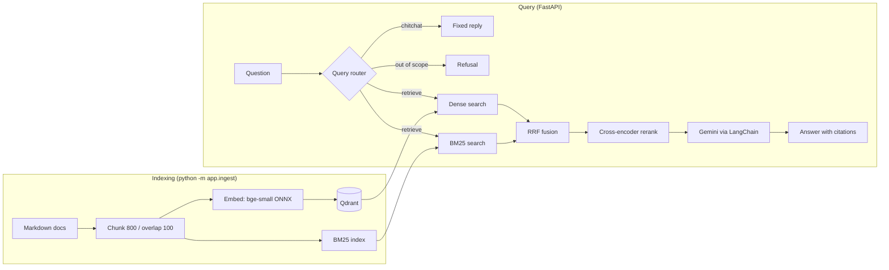

# RAG Eval Service

A retrieval-augmented generation (RAG) API over the FastAPI documentation, built around one question: **does each retrieval component actually improve results, and what does it cost?**

Instead of "upload a PDF and chat", every stage (dense, BM25, hybrid fusion, cross-encoder reranking) is measured on a fixed benchmark, so changes are justified by numbers.

**Stack:** Python, FastAPI, Qdrant (embedded), BM25, fastembed (ONNX), LangChain, Gemini, scikit-learn.

## Results

Retrieval quality on a 40-question benchmark over 2,437 chunks (156 docs). Latency is retrieval only (no LLM), measured on a CPU laptop.

<!-- RESULTS:START -->
| Mode | Hit@1 | Hit@5 | MRR@10 | Source Hit@5 | p50 ms | p95 ms |
|---|---|---|---|---|---|---|
| Dense (bge-small) | 0.6 | 0.925 | 0.713 | 0.975 | 17.1 | 59.6 |
| BM25 | 0.65 | 0.825 | 0.717 | 0.9 | 7.0 | 10.0 |
| Hybrid (RRF) | 0.725 | 0.925 | 0.801 | 0.975 | 22.9 | 25.6 |
| Hybrid + rerank (top 5) | 0.8 | 0.925 | 0.852 | 0.975 | 604.1 | 821.8 |
| Hybrid + rerank (top 10) | 0.825 | 0.95 | 0.877 | 0.975 | 930.9 | 1268.9 |
| Hybrid + rerank (default pool) | 0.825 | 0.95 | 0.877 | 0.975 | 1634.6 | 2824.5 |
<!-- RESULTS:END -->

- **Hit@k:** the exact gold chunk appears in the top k results. **MRR@10:** mean reciprocal rank of the gold chunk. **Source Hit@5:** the correct document appears in the top 5.
- Reading the table: reciprocal rank fusion of dense and BM25 improves ranking over either alone, and the cross-encoder reranker improves it further. Hit@5 is already near its ceiling, so the gains show up in Hit@1 and MRR.
- The reranker costs roughly 1 s of CPU latency per query. In the candidate-pool sweep, scoring more than the top 10 hybrid candidates did not improve quality on this benchmark.
- p95 is noisy with 40 queries (it is effectively the second-slowest query), so compare p50.

## Architecture



Models load once at startup (FastAPI lifespan). Embeddings and the reranker run through ONNX Runtime, so there is no PyTorch dependency, which keeps the install small.

## Query router

Before retrieval, a small classifier decides what kind of message it is:

- **retrieve:** a question about FastAPI, so the normal pipeline runs.
- **chitchat:** a greeting or thanks, answered with a fixed reply (no retrieval, no LLM call).
- **out_of_scope:** unrelated to FastAPI, refused instead of answered from unrelated chunks.

The router is a scikit-learn logistic regression on the same `bge-small` embeddings used for retrieval. If a non-retrieve prediction has low confidence, the question is retrieved anyway, because wrongly refusing a real question is worse than a wasted search.

<!-- ROUTER:START -->
| Class | Precision | Recall | F1 |
|---|---|---|---|
| retrieve | 0.907 | 0.971 | 0.938 |
| chitchat | 0.978 | 1.0 | 0.989 |
| out_of_scope | 0.947 | 0.818 | 0.878 |

5-fold cross-validated accuracy: **0.937** on 159 labelled examples. Retrieval test-set questions routed to `retrieve`: **40/40**.
<!-- ROUTER:END -->

Metrics come from 5-fold cross-validation on `eval/router_data.json`. The last line checks the 40 retrieval benchmark questions against the router, since a false refusal there would be a real failure.

**Limitations:** the training set is small (about 150 hand-written examples), so these figures are indicative and probably optimistic for real user traffic. Borderline questions (for example general Python or web topics partly covered by the docs) can be routed either way.

## API

| Endpoint | Purpose |
|---|---|
| `GET /health` | Status, chunk count, whether the LLM is configured |
| `POST /retrieve` | Retrieval only (`mode`: `dense`, `bm25`, `hybrid`, `hybrid_rerank`) |
| `POST /query` | Routes the question, then retrieval + Gemini answer with `[n]` citations and per-stage latency |

Interactive docs at `/docs` once the server is running.

## Run it

```bash
git clone <repo-url> && cd <repo-name>
python -m venv .venv && source .venv/bin/activate   # Windows: .venv\Scripts\activate
pip install -r requirements.txt
cp .env.example .env                               # add GOOGLE_API_KEY
```

Get the corpus (FastAPI docs) into `data/docs/`:

```bash
git clone --depth 1 --filter=blob:none --sparse https://github.com/fastapi/fastapi.git tmp_fastapi
cd tmp_fastapi && git sparse-checkout set docs/en/docs && cd ..
cp -r tmp_fastapi/docs/en/docs/* data/docs/
```

Build the index, train the query router, then start the API (stop the API before re-indexing; embedded Qdrant allows one process):

```bash
python -m app.ingest
python -m eval.train_router     # trains the query router
uvicorn app.main:app --reload
```

## Reproduce the evaluation

```bash
python -m eval.run_ablation       # prints the table and writes eval/results.json
python -m eval.train_router       # trains/evaluates the query router
python -m eval.update_readme      # refreshes the Results and Router tables in this README
```

## Evaluation method and limitations

- **Benchmark:** 40 questions, each with one gold chunk. 15 were generated by Gemini from sampled chunks; 25 were written by hand (drafted with AI assistance, then checked against the index). Chunk IDs depend on the exact corpus and chunking settings, so re-indexing a different corpus invalidates the test set.
- **Small sample:** each question is worth 2.5 points, so differences of one or two questions are noise. Treat results as indicative, not conclusive.
- **Lexical bias:** many questions reuse the docs' wording, which favours BM25. Paraphrased questions would be a harder test.
- **Single gold chunk:** neighbouring chunks often answer the same question, so chunk-level metrics are strict. Source Hit@5 shows document-level quality.
- **Latency:** is from one CPU machine and one run; it is a relative comparison between stages, not a production benchmark.
- **Router dataset:** the query router uses about 150 hand-written examples, so its cross-validation figures are indicative and may be optimistic compared with real user traffic.
- **Router fallback:** low-confidence non-retrieve predictions fall back to retrieval to reduce the chance of incorrectly refusing a legitimate FastAPI question.
- **Router benchmark check:** the 40 retrieval benchmark questions are also passed through the router to detect false refusals before they reach the retrieval pipeline.

## Design decisions

- **Hybrid retrieval:** dense embeddings capture meaning but miss exact identifiers; BM25 catches those. Reciprocal rank fusion merges the two rankings without tuning score scales.
- **Two-stage ranking:** a cheap first stage for recall, then a cross-encoder over a small candidate pool for precision. The candidate-pool size is a quality/latency knob.
- **Query router:** a lightweight logistic regression classifier separates retrieval questions from chitchat and out-of-scope questions, avoiding unnecessary retrieval and reducing unrelated answers from the FastAPI corpus.
- **Conservative routing:** if a non-retrieve prediction has low confidence, the question falls back to retrieval rather than being immediately refused.
- **ONNX instead of PyTorch:** for embeddings and reranking: smaller install, lower memory use, easier to deploy.

## Roadmap

Not built yet: streaming responses, LLM-judged faithfulness evaluation, authentication, a web UI, and a deployed demo.

## Project layout

```text
app/        FastAPI service (ingest, retrieve, generate, schemas, config)
eval/       test set, router training, ablation runner, README updater
data/docs/  corpus (not committed)
```
