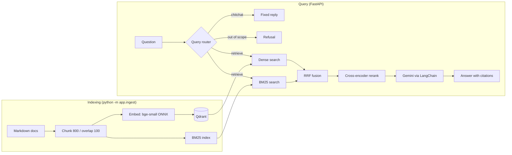

# 🔎 FastAPI Docs Assistant

> A retrieval-augmented generation (RAG) API over the FastAPI documentation, built around one question: **does each retrieval component actually improve results, and what does it cost?**

Instead of simply "upload a PDF and chat," this project evaluates every retrieval stage—**dense retrieval, BM25, hybrid fusion, and cross-encoder reranking**—on a fixed benchmark so that changes can be justified with measurable results.

**Stack:** Python, FastAPI, Qdrant (embedded), BM25, fastembed (ONNX), LangChain, Gemini, scikit-learn.

---

## Results

Retrieval quality on a **40-question benchmark** over **2,437 chunks from 156 documents**.

Latency measures retrieval only (no LLM generation) and was measured on a CPU laptop.

<!-- RESULTS:START -->

| Mode | Hit@1 | Hit@5 | MRR@10 | Source Hit@5 | p50 ms | p95 ms |
|---|---:|---:|---:|---:|---:|---:|
| Dense (bge-small) | 0.600 | 0.925 | 0.713 | 0.975 | 17.1 | 59.6 |
| BM25 | 0.650 | 0.825 | 0.717 | 0.900 | 7.0 | 10.0 |
| Hybrid (RRF) | 0.725 | 0.925 | 0.801 | 0.975 | 22.9 | 25.6 |
| Hybrid + rerank (top 5) | 0.800 | 0.925 | 0.852 | 0.975 | 604.1 | 821.8 |
| Hybrid + rerank (top 10) | 0.825 | 0.950 | 0.877 | 0.975 | 930.9 | 1268.9 |
| Hybrid + rerank (default pool) | 0.825 | 0.950 | 0.877 | 0.975 | 1634.6 | 2824.5 |

<!-- RESULTS:END -->

### Metrics

- **Hit@k:** whether the exact gold chunk appears in the top `k` results.
- **MRR@10:** mean reciprocal rank of the gold chunk within the top 10 results.
- **Source Hit@5:** whether the correct source document appears in the top 5 results.

### What the results show

- **Hybrid retrieval improves ranking:** Reciprocal Rank Fusion (RRF) combines dense and BM25 rankings and improves ranking quality over either method individually.
- **Reranking improves precision:** The cross-encoder provides additional gains, particularly in Hit@1 and MRR@10.
- **Hit@5 is already high:** Because the first-stage retrieval methods already achieve strong recall, the largest improvements from reranking appear in the ordering of the top results.
- **Reranking is significantly more expensive:** On CPU, reranking introduces roughly one second or more of latency per query.
- **Top-10 is sufficient for this benchmark:** Increasing the candidate pool beyond the top 10 hybrid results did not improve retrieval quality on these 40 questions.
- **Prefer p50 for latency comparisons:** With only 40 queries, p95 is noisy and is effectively determined by the second-slowest query.

---

## Architecture



Models are loaded once at startup using the FastAPI lifespan.

Both embeddings and reranking run through **ONNX Runtime**, avoiding a PyTorch dependency and keeping the installation smaller.

---

## Query Router

Before retrieval, a lightweight classifier determines what type of message it received:

- **`retrieve`** — a question related to FastAPI, so the normal RAG pipeline runs.
- **`chitchat`** — greetings, thanks, or casual conversation. These receive a fixed response without retrieval or an LLM call.
- **`out_of_scope`** — questions unrelated to FastAPI. These are refused instead of being answered from unrelated documentation chunks.

The router uses **scikit-learn Logistic Regression** over the same `bge-small` embeddings used by the retrieval pipeline.

If a non-`retrieve` prediction has low confidence, the question falls back to retrieval. This makes the router conservative: a potentially valid FastAPI question is less likely to be incorrectly rejected.

<!-- ROUTER:START -->

| Class | Precision | Recall | F1 |
|---|---:|---:|---:|
| retrieve | 0.907 | 0.971 | 0.938 |
| chitchat | 0.978 | 1.000 | 0.989 |
| out_of_scope | 0.947 | 0.818 | 0.878 |

**5-fold cross-validated accuracy:** 0.937 on 159 labelled examples.

**Retrieval benchmark questions routed to `retrieve`:** 40/40.

<!-- ROUTER:END -->

Metrics come from 5-fold cross-validation on `eval/router_data.json`.

The final check passes the 40 retrieval benchmark questions through the router to detect false refusals before they reach the retrieval pipeline.

### Router limitations

The training set contains only about 150 hand-written examples, so these results are indicative and may be optimistic compared with real-world traffic.

Borderline questions—for example, general Python or web-development questions that overlap with FastAPI—may be routed differently depending on the classifier's confidence.

---

## API

| Endpoint | Purpose |
|---|---|
| `GET /health` | Returns service status, chunk count, and whether the LLM is configured |
| `POST /retrieve` | Runs retrieval only. Supports `dense`, `bm25`, `hybrid`, and `hybrid_rerank` modes |
| `POST /query` | Routes the question, performs retrieval, and generates a Gemini answer with `[n]` citations and per-stage latency |

Interactive API documentation is available at:

```text
/docs
```

once the server is running.

---

## Run Locally

### 1. Clone the repository

```bash
git clone https://github.com/rohanpatil018/FastAPI-Docs-Assistant.git
cd FastAPI-Docs-Assistant
```

### 2. Create a virtual environment

**Linux/macOS:**

```bash
python -m venv .venv
source .venv/bin/activate
```

**Windows:**

```powershell
python -m venv .venv
.venv\Scripts\activate
```

### 3. Install dependencies

```bash
pip install -r requirements.txt
```

### 4. Configure environment variables

```bash
cp .env.example .env
```

Add your Gemini API key to `.env`:

```env
GOOGLE_API_KEY=your_api_key
```

### 5. Download the FastAPI documentation

Clone the FastAPI repository using sparse checkout:

```bash
git clone --depth 1 --filter=blob:none --sparse https://github.com/fastapi/fastapi.git tmp_fastapi
cd tmp_fastapi
git sparse-checkout set docs/en/docs
cd ..
```

Copy the documentation into the project:

```bash
cp -r tmp_fastapi/docs/en/docs/* data/docs/
```

### 6. Build the index

```bash
python -m app.ingest
```

This creates the vector and BM25 indexes used by the retrieval pipeline.

### 7. Train the query router

```bash
python -m eval.train_router
```

### 8. Start the API

```bash
uvicorn app.main:app --reload
```

The API will then be available at:

```text
http://localhost:8000
```

Interactive documentation:

```text
http://localhost:8000/docs
```

> **Note:** Stop the API before re-indexing. Embedded Qdrant is designed for a single process accessing the local database.

---

## Reproduce the Evaluation

Run the retrieval ablation:

```bash
python -m eval.run_ablation
```

This prints the evaluation table and writes:

```text
eval/results.json
```

Train and evaluate the query router:

```bash
python -m eval.train_router
```

Update the README tables automatically:

```bash
python -m eval.update_readme
```

---

## Evaluation Methodology & Limitations

### Benchmark

The retrieval benchmark contains **40 questions**, each associated with one gold chunk.

- 15 questions were generated by Gemini from sampled chunks.
- 25 questions were written manually, with AI assistance during drafting.
- All questions were checked against the indexed corpus.

Chunk IDs depend on the exact corpus and chunking configuration. Re-indexing a different corpus can therefore invalidate the existing benchmark.

### Small sample size

There are only 40 retrieval questions, meaning each question represents **2.5 percentage points**.

Differences of one or two questions should therefore be treated as noise rather than strong evidence of a meaningful improvement.

### Lexical bias

Many benchmark questions reuse terminology from the FastAPI documentation. This benefits lexical retrieval methods such as BM25.

A stronger future benchmark would include more paraphrased and natural user questions.

### Single gold chunk

Each question currently has a single gold chunk.

In practice, neighbouring chunks may contain information that answers the same question. Chunk-level metrics can therefore be strict.

**Source Hit@5** provides a document-level view of retrieval quality.

### Latency

Latency was measured on one CPU machine and one run.

The values should therefore be interpreted as a **relative comparison between retrieval stages**, not as a production performance benchmark.

### Query router

The router is trained on approximately 150 hand-written examples.

Its cross-validation metrics are therefore indicative and may be optimistic compared with unseen real-world traffic.

### Conservative routing

Low-confidence non-`retrieve` predictions fall back to retrieval. This reduces the chance of incorrectly refusing a legitimate FastAPI question.

### Router benchmark check

The 40 retrieval benchmark questions are also passed through the query router to verify that legitimate retrieval questions are not incorrectly classified as `chitchat` or `out_of_scope`.

---

## Design Decisions

### Hybrid Retrieval

Dense embeddings capture semantic similarity but can miss exact identifiers, function names, parameters, and terminology.

BM25 provides strong lexical matching for these cases.

**Reciprocal Rank Fusion (RRF)** combines both rankings without requiring the scores from the two retrieval systems to be calibrated onto the same scale.

### Two-Stage Ranking

The retrieval pipeline separates **recall** from **precision**:

1. Dense + BM25 retrieval provides a broad candidate set.
2. RRF combines the candidate rankings.
3. A cross-encoder reranks a small candidate pool.
4. The highest-ranked chunks are passed to the generation stage.

The candidate-pool size provides a direct quality/latency trade-off.

### Query Router

A lightweight Logistic Regression classifier separates:

- FastAPI questions
- chitchat
- out-of-scope questions

This avoids unnecessary retrieval and reduces the chance of answering unrelated questions using the FastAPI documentation.

### Conservative Routing

When the classifier is uncertain about a non-retrieve prediction, the system falls back to retrieval rather than immediately refusing the request.

### ONNX Instead of PyTorch

Embeddings and reranking run through ONNX Runtime rather than PyTorch.

This keeps the deployment smaller and reduces the number of heavyweight dependencies required by the application.

---

## Roadmap

Planned improvements:

- [ ] Streaming responses
- [ ] LLM-based faithfulness evaluation
- [ ] Authentication
- [ ] Web UI
- [ ] Deployed public demo

---

## Project Structure

```text
.
├── app/
│   ├── FastAPI service
│   ├── ingest
│   ├── retrieve
│   ├── generate
│   ├── schemas
│   └── config
│
├── eval/
│   ├── test set
│   ├── router training
│   ├── ablation runner
│   └── README updater
│
├── data/
│   └── docs/              # FastAPI documentation corpus (not committed)
│
├── README.md
├── requirements.txt
└── .env.example
```

---

## Why This Project?

The goal is not just to build another RAG chatbot.

The project treats retrieval as an **engineering system that should be measured**.

Each retrieval component is evaluated independently to answer:

- Does dense retrieval help?
- Does BM25 add useful lexical matching?
- Does hybrid fusion improve ranking?
- Does reranking justify its latency cost?
- How large should the reranking candidate pool be?
- Can a lightweight router prevent unnecessary retrieval?
- Does the router accidentally reject legitimate FastAPI questions?

The result is a RAG system where retrieval decisions are backed by **benchmark results rather than intuition**.
